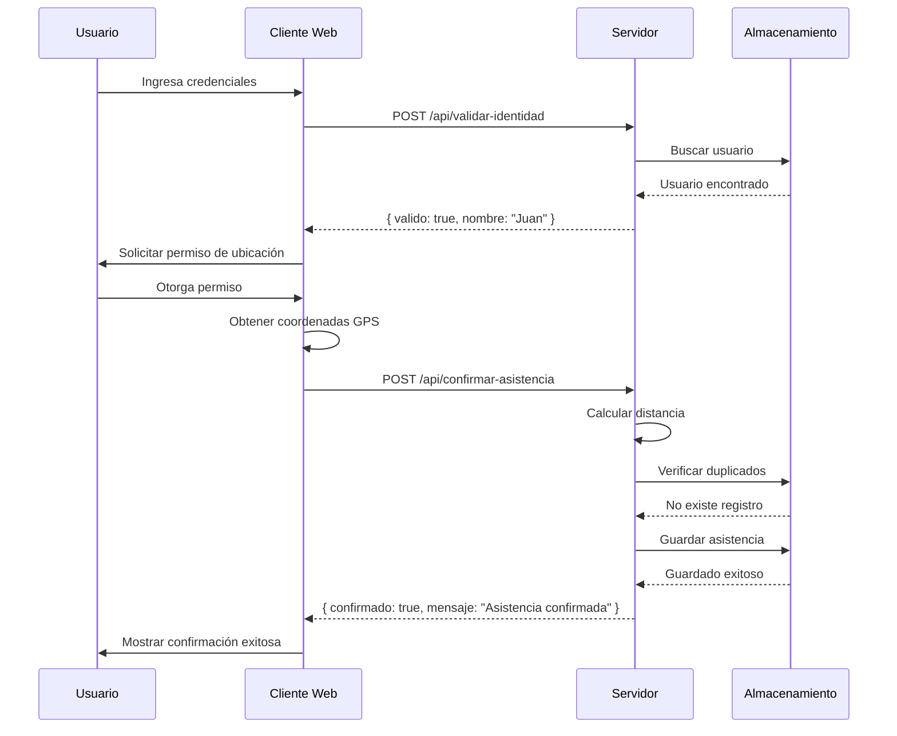
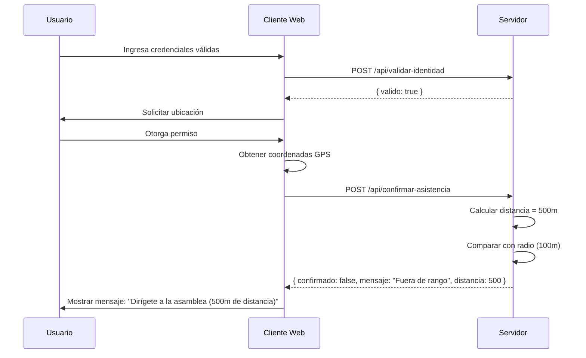

# Documento de Diseño: Sistema de Confirmación de Asistencia a Asambleas

## Visión General

El sistema será una aplicación web simple y ligera que permite confirmar la asistencia de personas a asambleas mediante verificación de identidad y validación de ubicación geográfica. El diseño prioriza la simplicidad, facilidad de despliegue y código mínimo.

### Principios de Diseño

1. **Simplicidad primero**: Usar tecnologías web estándar sin frameworks complejos
2. **Despliegue mínimo**: Una aplicación que pueda ejecutarse con configuración mínima
3. **Código reducido**: Implementación directa sin abstracciones innecesarias
4. **Funcionalidad core**: Solo las características esenciales para cumplir los requisitos

## Arquitectura

### Arquitectura General

```
┌─────────────────┐
│   Navegador     │
│   Web (Cliente) │
│                 │
│  - HTML/CSS/JS  │
│  - Geolocation  │
│    API          │
└────────┬────────┘
         │
         │ HTTP/HTTPS
         │
┌────────▼────────┐
│   Servidor Web  │
│   Simple        │
│                 │
│  - API REST     │
│  - Validación   │
└────────┬────────┘
         │
         │
┌────────▼────────┐
│  Almacenamiento │
│                 │
│  - JSON File    │
│  - Usuarios     │
│  - Asistencias  │
└─────────────────┘
```

### Decisiones Arquitectónicas

1. **Cliente Web Puro**: Interfaz HTML/CSS/JavaScript sin frameworks (React, Vue, etc.) para minimizar complejidad
2. **Backend Ligero**: Servidor simple con Node.js/Express o Python/Flask
3. **Almacenamiento Simple**: Archivos JSON para datos (usuarios, configuración, asistencias)
4. **API REST Mínima**: Solo endpoints esenciales para autenticación, validación y registro

## Componentes e Interfaces

### 1. Cliente Web (Frontend)

**Responsabilidades:**
- Capturar credenciales del usuario
- Solicitar y obtener ubicación geográfica del dispositivo
- Mostrar interfaz de usuario y mensajes de estado
- Comunicarse con el backend mediante API REST
- Proporcionar interfaz administrativa para gestionar usuarios autorizados

**Archivos:**
- `index.html`: Estructura de la página principal (confirmación de asistencia)
- `admin.html`: Interfaz administrativa para gestionar usuarios
- `styles.css`: Estilos visuales
- `app.js`: Lógica de la aplicación cliente (confirmación)
- `admin.js`: Lógica de administración de usuarios

**Funciones Principales:**

```javascript
// Obtener ubicación del usuario
async function obtenerUbicacion()

// Validar credenciales con el backend
async function validarIdentidad(credenciales)

// Confirmar asistencia
async function confirmarAsistencia(userId, ubicacion)

// Calcular distancia entre dos puntos geográficos (Haversine)
function calcularDistancia(lat1, lon1, lat2, lon2)

// Mostrar mensajes al usuario
function mostrarMensaje(tipo, mensaje)

// Funciones administrativas
async function cargarListaUsuarios()
async function agregarNuevoUsuario(usuario)
async function editarUsuario(userId, datos)
async function eliminarUsuario(userId)
```

### 2. Servidor Backend

**Responsabilidades:**
- Validar credenciales contra la base de datos
- Verificar ubicación del usuario vs ubicación de la asamblea
- Registrar asistencias confirmadas
- Prevenir registros duplicados
- Servir archivos estáticos del frontend

**Endpoints API:**

```
POST /api/validar-identidad
  Body: { "userId": "string", "documento": "string" }
  Response: { "valido": boolean, "nombre": "string" }

POST /api/confirmar-asistencia
  Body: { 
    "userId": "string",
    "latitud": number,
    "longitud": number
  }
  Response: { 
    "confirmado": boolean,
    "mensaje": "string",
    "distancia": number
  }

GET /api/configuracion
  Response: {
    "ubicacionAsamblea": { "latitud": number, "longitud": number },
    "radioPermitido": number
  }

GET /api/asistencias
  Response: [
    {
      "userId": "string",
      "nombre": "string",
      "fechaHora": "ISO8601 string",
      "ubicacion": { "latitud": number, "longitud": number }
    }
  ]

GET /api/usuarios
  Response: [
    {
      "userId": "string",
      "documento": "string",
      "nombre": "string"
    }
  ]

POST /api/usuarios
  Body: {
    "userId": "string",
    "documento": "string",
    "nombre": "string"
  }
  Response: { "success": boolean, "mensaje": "string" }

PUT /api/usuarios/:userId
  Body: {
    "documento": "string",
    "nombre": "string"
  }
  Response: { "success": boolean, "mensaje": "string" }

DELETE /api/usuarios/:userId
  Response: { "success": boolean, "mensaje": "string" }
```

**Funciones Principales:**

```javascript
// Cargar usuarios desde archivo CSV
function cargarUsuariosCSV()

// Parsear CSV a array de objetos
function parsearCSV(contenidoCSV)

// Validar credenciales de usuario
function validarCredenciales(userId, documento)

// Calcular distancia usando fórmula de Haversine
function calcularDistanciaHaversine(lat1, lon1, lat2, lon2)

// Verificar si usuario ya confirmó asistencia
function yaConfirmo(userId)

// Registrar asistencia en archivo JSON
function registrarAsistencia(userId, ubicacion, fechaHora)

// Cargar configuración de asamblea
function cargarConfiguracion()

// Gestión de usuarios autorizados
function agregarUsuarioCSV(usuario)
function actualizarUsuarioCSV(userId, datosActualizados)
function eliminarUsuarioCSV(userId)
function obtenerUsuarios()
function exportarUsuariosCSV()

// Watch file para recargar usuarios cuando CSV cambie
function watchUsuariosCSV()
```

### 3. Capa de Datos

**Estructura de Archivos:**

**usuarios.csv:**
```csv
userId,documento,nombre
12345678,12345678,Juan Pérez
87654321,87654321,María García
11223344,11223344,Carlos López
```

**configuracion.json:**
```json
{
  "ubicacionAsamblea": {
    "latitud": -12.0464,
    "longitud": -77.0428
  },
  "radioPermitido": 100
}
```

**asistencias.json:**
```json
[
  {
    "userId": "12345678",
    "nombre": "Juan Pérez",
    "fechaHora": "2026-01-14T10:30:00Z",
    "ubicacion": {
      "latitud": -12.0465,
      "longitud": -77.0429
    }
  }
]
```

**Nota sobre Formato CSV:**
- El archivo `usuarios.csv` puede editarse directamente en Excel, Google Sheets o cualquier editor de texto
- Facilita la importación masiva de usuarios (copiar/pegar desde otras fuentes)
- El servidor debe parsear CSV al inicio y recargar cuando el archivo cambie
- Mantener asistencias en JSON ya que se generan automáticamente y no requieren edición manual frecuente

## Modelos de Datos

### Usuario

```typescript
interface Usuario {
  userId: string;        // Identificador único
  documento: string;     // Número de documento
  nombre: string;        // Nombre completo
}
```

### Configuración de Asamblea

```typescript
interface ConfiguracionAsamblea {
  ubicacionAsamblea: {
    latitud: number;     // Latitud en grados decimales
    longitud: number;    // Longitud en grados decimales
  };
  radioPermitido: number; // Radio en metros
}
```

### Registro de Asistencia

```typescript
interface Asistencia {
  userId: string;        // Identificador del usuario
  nombre: string;        // Nombre del usuario
  fechaHora: string;     // Timestamp ISO8601
  ubicacion: {
    latitud: number;     // Latitud donde confirmó
    longitud: number;    // Longitud donde confirmó
  };
}
```

## Flujo de Interacción

### Flujo Principal: Confirmación de Asistencia

```
1. Usuario accede a la aplicación web
   ↓
2. Sistema muestra formulario de identificación
   ↓
3. Usuario ingresa credenciales (userId/documento)
   ↓
4. Sistema valida credenciales con backend
   ↓
5. Si válido: Sistema solicita permiso de ubicación
   Si inválido: Mostrar error y terminar
   ↓
6. Usuario otorga permiso de ubicación
   ↓
7. Sistema obtiene coordenadas del dispositivo
   ↓
8. Sistema envía userId y ubicación al backend
   ↓
9. Backend calcula distancia a la asamblea
   ↓
10. Si distancia <= radioPermitido:
      - Registrar asistencia
      - Mostrar confirmación exitosa
    Si distancia > radioPermitido:
      - Mostrar mensaje con instrucciones
      - Indicar que debe acercarse a la asamblea
```

### Algoritmo de Cálculo de Distancia (Haversine)

La fórmula de Haversine calcula la distancia entre dos puntos en una esfera dados sus coordenadas:

```
a = sin²(Δlat/2) + cos(lat1) × cos(lat2) × sin²(Δlon/2)
c = 2 × atan2(√a, √(1−a))
d = R × c

Donde:
- R = radio de la Tierra (6371 km)
- Δlat = lat2 - lat1
- Δlon = lon2 - lon1
- d = distancia en kilómetros
```

## Propiedades de Corrección


*Una propiedad es una característica o comportamiento que debe mantenerse verdadero en todas las ejecuciones válidas del sistema - esencialmente, una declaración formal sobre lo que el sistema debe hacer. Las propiedades sirven como puente entre las especificaciones legibles por humanos y las garantías de corrección verificables por máquina.*

### Propiedades Identificadas

**Property 1: Validación de credenciales correcta**

*Para cualquier* conjunto de credenciales (userId, documento), el sistema debe validarlas contra la base de datos y retornar verdadero si y solo si existe un usuario con esos datos exactos, y falso en caso contrario.

**Validates: Requirements 1.1, 1.3**

---

**Property 2: Credenciales válidas permiten continuar**

*Para cualquier* usuario con credenciales válidas en la base de datos, después de una validación exitosa, el sistema debe permitir acceder a la siguiente etapa del proceso (solicitud de ubicación).

**Validates: Requirements 1.2**

---

**Property 3: Identificador único requerido**

*Para cualquier* intento de validación sin un identificador único (userId o documento vacío/nulo), el sistema debe rechazar la solicitud antes de consultar la base de datos.

**Validates: Requirements 1.4**

---

**Property 4: Cálculo de distancia correcto**

*Para cualquier* par de coordenadas geográficas (ubicación usuario, ubicación asamblea), el sistema debe calcular la distancia usando la fórmula de Haversine y retornar un valor en metros que sea geométricamente correcto.

**Validates: Requirements 2.2**

---

**Property 5: Validación de ubicación basada en radio**

*Para cualquier* ubicación de usuario, si la distancia calculada a la ubicación de la asamblea es menor o igual al radio permitido, el sistema debe permitir la confirmación; si es mayor, debe denegarla con mensaje de instrucciones.

**Validates: Requirements 2.3, 2.4**

---

**Property 6: Registro de asistencia con datos completos**

*Para cualquier* confirmación exitosa (identidad válida y ubicación correcta), el sistema debe registrar una asistencia que incluya userId, nombre, timestamp ISO8601, y coordenadas de ubicación.

**Validates: Requirements 3.1, 3.4**

---

**Property 7: Idempotencia de confirmación de asistencia**

*Para cualquier* usuario, confirmar asistencia múltiples veces debe resultar en un solo registro de asistencia - el sistema debe prevenir duplicados basándose en userId.

**Validates: Requirements 3.3**

---

**Property 8: Round-trip de configuración**

*Para cualquier* configuración válida de asamblea (ubicación y radio), después de guardarla y luego consultarla, el sistema debe retornar los mismos valores.

**Validates: Requirements 4.1, 4.2**

---

**Property 9: Round-trip de usuarios y asistencias**

*Para cualquier* lista de usuarios almacenada en la base de datos, al consultar la lista completa, el sistema debe retornar todos los usuarios con sus datos completos e inalterados. Lo mismo aplica para el listado de asistencias confirmadas.

**Validates: Requirements 4.3, 4.4**

---

## Manejo de Errores

### Estrategia General

El sistema debe manejar errores de manera clara y proporcionar mensajes útiles al usuario. Los errores se clasifican en:

1. **Errores de Validación**: Credenciales inválidas, identificador faltante
2. **Errores de Ubicación**: Permisos denegados, ubicación no disponible, fuera de rango
3. **Errores de Sistema**: Problemas de red, servidor no disponible, errores de almacenamiento

### Manejo Específico por Tipo

**Errores de Validación:**
- Código HTTP: 401 Unauthorized (credenciales inválidas) o 400 Bad Request (datos faltantes)
- Mensaje al usuario: "Credenciales inválidas. Por favor verifica tu número de documento."
- Acción: Permitir reintento, no bloquear al usuario

**Errores de Ubicación:**
- Permisos denegados:
  - Mensaje: "Se requiere acceso a tu ubicación para confirmar asistencia. Por favor habilita los permisos de ubicación."
  - Acción: Mostrar instrucciones para habilitar permisos
  
- Fuera de rango:
  - Código HTTP: 403 Forbidden
  - Mensaje: "No te encuentras en la ubicación de la asamblea. Por favor dirígete al lugar del evento. Distancia actual: X metros."
  - Acción: Mostrar distancia y dirección aproximada

**Errores de Sistema:**
- Código HTTP: 500 Internal Server Error o 503 Service Unavailable
- Mensaje: "Error del sistema. Por favor intenta nuevamente en unos momentos."
- Acción: Log del error en servidor, permitir reintento

### Validaciones de Entrada

**Backend debe validar:**
- Formato de coordenadas (latitud: -90 a 90, longitud: -180 a 180)
- Tipos de datos correctos (números para coordenadas, strings para IDs)
- Campos requeridos presentes y no vacíos
- Radio permitido debe ser positivo

## Estrategia de Testing

### Enfoque Dual: Unit Tests y Property-Based Tests

El sistema utilizará dos tipos complementarios de pruebas:

1. **Unit Tests**: Verifican ejemplos específicos, casos edge y condiciones de error
2. **Property-Based Tests**: Verifican propiedades universales a través de muchas entradas generadas

Ambos tipos son necesarios para cobertura comprehensiva:
- Los unit tests capturan bugs concretos y casos específicos
- Los property tests verifican corrección general a través de randomización

### Property-Based Testing

**Framework**: Utilizaremos **fast-check** para JavaScript/Node.js, que es una biblioteca madura de property-based testing.

**Configuración**:
- Mínimo 100 iteraciones por test de propiedad
- Cada test debe referenciar su propiedad del documento de diseño
- Formato de tag: `Feature: asistencia-asamblea, Property N: [texto de propiedad]`

**Propiedades a Testear**:

1. **Property 1**: Validación de credenciales
   - Generador: Credenciales aleatorias (válidas e inválidas)
   - Verificación: Resultado coincide con presencia en BD

2. **Property 4**: Cálculo de distancia Haversine
   - Generador: Pares de coordenadas aleatorias
   - Verificación: Distancia calculada es geométricamente correcta (comparar con implementación de referencia)

3. **Property 5**: Validación de ubicación
   - Generador: Ubicaciones aleatorias dentro y fuera del radio
   - Verificación: Decisión de permitir/denegar es correcta según distancia

4. **Property 7**: Idempotencia de confirmación
   - Generador: Usuarios aleatorios, número aleatorio de intentos de confirmación
   - Verificación: Solo un registro por usuario en la base de datos

5. **Property 8**: Round-trip de configuración
   - Generador: Configuraciones aleatorias válidas
   - Verificación: Guardar y luego leer retorna valores idénticos

6. **Property 9**: Round-trip de datos
   - Generador: Listas aleatorias de usuarios y asistencias
   - Verificación: Almacenar y consultar retorna datos completos e inalterados

### Unit Testing

**Casos Específicos a Testear**:

1. **Validación de identidad**:
   - Usuario válido conocido retorna éxito
   - Usuario inválido conocido retorna error
   - Credenciales vacías son rechazadas

2. **Cálculo de distancia**:
   - Distancia entre dos puntos idénticos es 0
   - Distancia es simétrica: d(A,B) = d(B,A)
   - Casos conocidos con distancias calculadas manualmente

3. **Validación de ubicación**:
   - Ubicación exacta de asamblea es aceptada
   - Ubicación en el borde del radio es aceptada
   - Ubicación 1 metro fuera del radio es rechazada

4. **Confirmación de asistencia**:
   - Primera confirmación exitosa registra asistencia
   - Segunda confirmación del mismo usuario no crea duplicado
   - Timestamp es generado correctamente

5. **Manejo de errores**:
   - Permisos de ubicación denegados muestra mensaje apropiado
   - Coordenadas inválidas son rechazadas
   - Errores de red son manejados gracefully

### Testing de Integración

**Flujos End-to-End**:
1. Flujo completo exitoso: validación → ubicación → confirmación
2. Flujo con credenciales inválidas
3. Flujo con ubicación fuera de rango
4. Flujo con permisos de ubicación denegados

### Estrategia de Generadores para Property Tests

**Generador de Coordenadas**:
```javascript
// Coordenadas válidas
fc.record({
  latitud: fc.double({ min: -90, max: 90 }),
  longitud: fc.double({ min: -180, max: 180 })
})
```

**Generador de Usuarios**:
```javascript
fc.record({
  userId: fc.string({ minLength: 1, maxLength: 20 }),
  documento: fc.string({ minLength: 1, maxLength: 20 }),
  nombre: fc.string({ minLength: 1, maxLength: 100 })
})
```

**Generador de Ubicaciones Dentro del Radio**:
```javascript
// Generar ubicaciones aleatorias dentro de un radio específico
// usando desplazamiento angular y distancia aleatoria
```

## Consideraciones de Implementación

### Gestión Manual de Base de Datos

**Formato CSV para Máxima Facilidad**

El sistema utiliza **CSV (Comma-Separated Values)** como formato principal para la base de datos de usuarios autorizados. Esto permite:

✓ Editar directamente en Excel, Google Sheets, LibreOffice Calc
✓ Importar/exportar fácilmente desde otras fuentes
✓ Agregar 1000+ usuarios mediante copiar/pegar
✓ Formato simple y universal

**Estructura del archivo usuarios.csv:**
```csv
userId,documento,nombre
12345678,12345678,Juan Pérez
87654321,87654321,María García
11223344,11223344,Carlos López
```

**Opción 1: Edición Directa en Excel/Sheets (RECOMENDADO)**

1. Abrir `usuarios.csv` en Excel o Google Sheets
2. Agregar/editar/eliminar filas según necesidad
3. Guardar el archivo
4. El servidor detecta cambios automáticamente y recarga la lista

**Ventajas:**
- Edición masiva fácil (copiar/pegar desde otras fuentes)
- Ordenar, filtrar, buscar usando funciones de Excel
- No requiere conocimientos técnicos
- Ideal para actualizar 1000+ invitados

**Opción 2: Interfaz Web Administrativa**

El sistema incluirá una página administrativa (`admin.html`) que permite:
- Ver lista completa de usuarios autorizados
- Agregar nuevos usuarios uno por uno
- Editar información de usuarios existentes
- Eliminar usuarios de la lista
- Exportar lista actual a CSV
- Importar CSV desde la interfaz web

**Opción 3: Recarga Manual**

Si el servidor no detecta cambios automáticamente:
- Endpoint: `POST /api/reload-usuarios`
- O reiniciar el servidor

**Validaciones al Cargar CSV:**
- Verificar que tenga las columnas requeridas: userId, documento, nombre
- Validar que no haya filas vacías o mal formateadas
- Detectar y reportar duplicados (mismo userId)
- Ignorar líneas con errores y continuar con las válidas

**Ejemplo de Importación Masiva:**

Si tienes una lista en Excel con columnas: ID, Documento, Nombre Completo
1. Copiar las columnas
2. Pegar en `usuarios.csv` (ajustar nombres de columnas si es necesario)
3. Guardar
4. El sistema carga automáticamente los nuevos usuarios

### Seguridad

1. **Validación de Entrada**: Todas las entradas del usuario deben ser validadas en el backend
2. **HTTPS**: La aplicación debe servirse sobre HTTPS para proteger datos de ubicación
3. **Rate Limiting**: Implementar límite de intentos para prevenir abuso
4. **Sanitización**: Sanitizar datos antes de almacenar en archivos JSON

### Performance

1. **Cálculo de Distancia**: Implementar en backend para evitar manipulación cliente
2. **Caché de Configuración**: Cargar configuración una vez al inicio del servidor
3. **Caché de Usuarios**: Cargar CSV en memoria al inicio, recargar solo cuando cambie
4. **Archivos CSV/JSON**: Suficiente para miles de usuarios; CSV es eficiente para lectura

**Nota sobre Escalabilidad de CSV:**
- CSV es adecuado para hasta 10,000+ usuarios
- Carga en memoria es rápida (< 1 segundo para 10,000 registros)
- Para más de 50,000 usuarios, considerar migrar a base de datos SQL

### Escalabilidad

Para despliegue inicial simple:
- Archivos CSV/JSON son adecuados para < 10,000 usuarios
- Un solo servidor puede manejar cientos de confirmaciones simultáneas
- CSV se carga en memoria para acceso rápido

Para escalar:
- Migrar a base de datos (SQLite, PostgreSQL) si > 50,000 usuarios
- Implementar caché (Redis) para sesiones
- Balanceo de carga si es necesario

### Despliegue

**Opción 1: Servidor Simple Local**
```bash
npm install
npm start
# Servidor corriendo en http://localhost:3000
```

**Opción 2: Despliegue en Cloud**
- Heroku (gratuito para proyectos pequeños)
- Vercel / Netlify (para frontend estático + serverless functions)
- AWS Lambda + API Gateway (serverless)

**Requisitos Mínimos**:
- Node.js 14+ o Python 3.8+
- 512MB RAM
- 100MB espacio en disco

## Diagramas de Secuencia

### Flujo Exitoso de Confirmación



### Flujo con Ubicación Fuera de Rango


